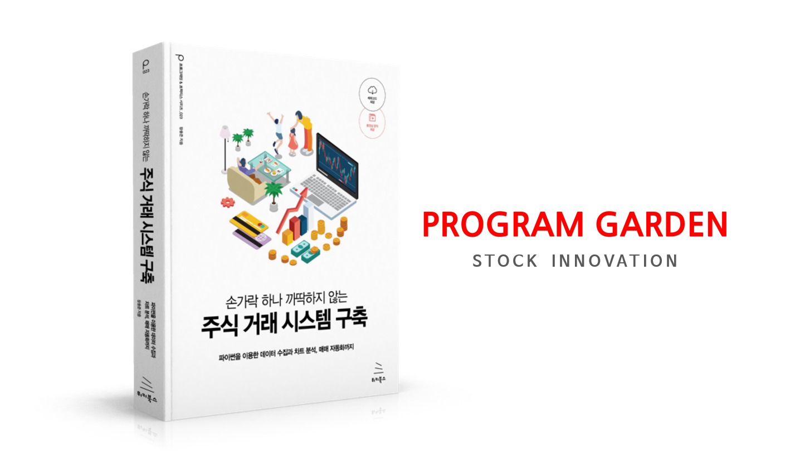

# 책 정보

 

### 교재 출판 1쇄,2쇄, 3쇄, 4쇄본 폴더로 나눔
>인쇄 버전에 맞는 예제코드를 사용해 주세요.

 

### 8장 수정사항 (교재출판 1쇄, 2쇄 버전용)
>2020년 5월6일을 시점으로 슬랙에서 토큰 정책을 변경했습니다. 

기존 방식은 다이렉트로 토큰을 생성하는 거였지만 이제는 불가능합니다. 이전에 생성한 사용자에게는 영향이 없지만, 5월6일 이후로 슬랙 토큰을 생성하려는 분들은 기존 방식으로 불가능 합니다.
  그래서 초판 교재로 공부중이신 분들은 **교재 281페이지 ~ 285페이지**까지의 내용을 아래 링크에 업데이트된 내용으로 학습하면 됩니다.

슬랙 토큰 받는 새로운 방법 ▶ [https://cafe.naver.com/programgarden/102][https://cafe.naver.com/programgarden/102]

3쇄 버전을 이용중이면 아래 링크로 학습하면 됩니다.

슬랙 토큰 받는 새로운 방법 ▶ https://cafe.naver.com/programgarden/1664

 

### 교재 정보 

>무료 강의 영상에 없는 내용이 서적에 많이 포함되어 있습니다.  
대표적으로 메세지 받는 방법과 HTS의 조건검색식을 파이썬과 연동하는 방법  
그리고 데이터 관리하는 커스텀 로그 구축입니다.  
그 외에도 폭 넓은 내용들 책에서 볼 수 있고 eBook으로도 제공하고 있습니다.

&nbsp;&nbsp;

&nbsp;&nbsp;

  

&nbsp;&nbsp;

  
---

   
# 프로그램 동산
많은 사람들의 삶을 개선 시켜주는 다양한 프로그램 교육을 무료로 제공하는 학습 커뮤니티

 

## 후원하기
우리의 학습 공유로  
멋진 인생이 만들어지길 바라며  
응원의 메세지를 부탁드립니다. 감사합니다.  

**신한은행 110-285-059020 장용준**

 

## 유튜브
https://www.youtube.com/c/프로그램동산PROGRAMGARDEN

 

## 구독자들 학습 커뮤니티
https://cafe.naver.com/programgarden/

 

## 학습 목록
### *증권 시스템 온라인 강의*
| 제목 | 난이도 | 강의 설명 |
|:-------|:-----:|:------|
| [24시간 주식매매 자동화 구축하기[open API+] ](https://youtube.com/playlist?list=PLDtzZPtOGenaSknTbsb6x6L39V0VPz_rS "24시간 주식매매 자동화 구축하기[open API+] ")| 초보 ~ 고수 | **강사** 프로그램 동산   **수강료** 무료   **예제피일** [https://github.com/programgarden/book](https://github.com/programgarden/book "https://github.com/programgarden/book")   **내용** 주식 자동화 시스템을 구축하는데 필요한 로직을 코딩합니다. 영상은 시중 교재("[손가락 하나 까딱하지 않는 주식 거래 시스템 구축](https://book.naver.com/bookdb/book_detail.nhn?bid=16330702 "손가락 하나 까딱하지 않는 주식 거래 시스템 구축")")의 참고용으로 학습하면 좋습니다.|
|[클래스101의 주식 고급 자동화 매매 강의](https://class101.net/products/GNNMfyIfdxmlByRtMbdI "클래스101의 주식 고급 자동화 매매 강의")|초보 ~ 고수|**강사** 프로그램 동산   **수강료** 245,300~   **예제피일** class101에서 코칭권 사용시 제공   **내용** 파이썬 왕기초부터 시작해서 증권사의 데이터를 활용하여 분봉, 이동평균선 그리고 신문기사 제목 분석까지 적용하는 자동화 매매 코딩을 배웁니다.|
|[프로그램 동산 파이썬의 정석](https://www.youtube.com/playlist?list=PLDtzZPtOGenaG_LeSAHpr4opgz0HebcwJ "프로그램 동산 파이썬의 정석")|초보|**강사** 프로그램 동산   **수강료** 무료   **예제피일** [https://github.com/programgarden/youtube/tree/master/python_basic](https://github.com/programgarden/youtube/tree/master/python_basic "https://github.com/programgarden/youtube/tree/master/python_basic")   **내용**  파이썬(코딩 언어)을 금융의 관점에서 상세하게 배웁니다. 문제풀이도 많아서 다른 강의와 병행 학습하면 좋습니다.|
|[해외선물 시스템을 처음 접하는 분들을 위한 강의](https://www.youtube.com/playlist?list=PLDtzZPtOGenY9XcxCMJyNCVOghZRyQYG6 "해외선물 시스템을 처음 접하는 분들을 위한 강의")|초보|**강사** 프로그램 동산   **수강료** 무료   **예제피일** 없음   **내용**  해외선물을 처음 접하는 분들을 위한 강의입니다.|
|[해외선물 초단타 스캘핑 자동화 매매](https://www.youtube.com/playlist?list=PLDtzZPtOGenaSBFu3e_XrDx9PTgSiljc5 "해외선물 초단타 스캘핑 자동화 매매")|초보 ~ 중수|**강사** 프로그램 동산   **수강료** 무료   **예제피일** [https://github.com/programgarden/youtube/tree/master/future_speed](https://github.com/programgarden/youtube/tree/master/future_speed "https://github.com/programgarden/youtube/tree/master/future_speed")   **내용**  해외선물 자동화 시스템을 만듭니다. 파이썬 왕기초부터 증권 프로그램으로 단방향 스캘핑 매매까지 자동화 시스템을 구축합니다.|
|[24시간 주식매매 자동화 구축 핵심 정리](https://vimeo.com/ondemand/openapi "24시간 주식매매 자동화 구축 핵심 정리")|중수 ~ 고수|**강사** 프로그램 동산   **수강료** 39,000   **예제피일** 없음   **내용**  "[손가락 하나 까딱하지 않는 주식 거래 시스템 구축](https://book.naver.com/bookdb/book_detail.nhn?bid=16330702 "손가락 하나 까딱하지 않는 주식 거래 시스템 구축")" 및 유튜브 강의의 복잡한 로직을 쉽게 이해할 수 있도록 핵심을 설명하는 2시간 강의입니다|
|[백테스팅 내 패던 검증하기](https://www.youtube.com/playlist?list=PLDtzZPtOGenaRsQOJY8DB44bGdd7lVO4h "백테스팅 내 패던 검증하기")|중수|**강사** 프로그램 동산   **수강료** 무료   **예제피일** [https://github.com/programgarden/youtube/tree/master/backtesting](https://github.com/programgarden/youtube/tree/master/backtesting "https://github.com/programgarden/youtube/tree/master/backtesting")   **내용**  프로그램 동산이 사용하던 백테스팅 코딩 방법을 알려줍니다. HTS의 차트 csv파일로 진행되며 패턴을 찾고 수익 검증을 하는데 기반이 되는 중요한 자료입니다. 연봉부터 일봉, 분봉... 틱봉까지 데이터의 시간만 알 수 있다면 다양하게 사용될 수 있습니다. 그 기반을 코딩으로 배웁니다.|
|[코인 24시간 매매 시스템 만들기](https://www.youtube.com/playlist?list=PLDtzZPtOGenb_spJa7NEoS-oqNo9RiF-_ "코인 24시간 매매 시스템 만들기")|중수 ~ 고수|**강사** 프로그램 동산   **수강료** 무료   **예제피일** [https://github.com/programgarden/youtube/tree/master/coin_basic](https://github.com/programgarden/youtube/tree/master/coin_basic "https://github.com/programgarden/youtube/tree/master/coin_basic")   **내용**  오픈소스로 제공되는 코인 거래소들의 api 사용법을 익힙니다. 거래소들의 api는 비슷한 형태를 가지고 있기 때문에 반복적인 설명으로 진행되고 거래소들의 특징들을 살펴봅니다.|
|[텔레그램으로 증권시스템 제어하기](https://www.youtube.com/watch?v=mlKcW2dT9QQ "텔레그램으로 증권시스템 제어하기")|중수 ~ 고수|**강사** 프로그램 동산   **수강료** 무료   **예제피일** [https://github.com/programgarden/youtube/tree/master/telegram_hard_version](https://github.com/programgarden/youtube/tree/master/telegram_hard_version "https://github.com/programgarden/youtube/tree/master/telegram_hard_version")   **내용**  오픈소스로 제공되는 코인 거래소들의 api 사용법을 익힙니다. 거래소들의 api는 비슷한 형태를 가지고 있기 때문에 반복적인 설명으로 진행되고 거래소들의 특징들을 살펴봅니다.|

  

### *데이터베이스 온라인 강의*
| 제목 | 난이도 | 강의 설명 |
|:-------|:-----:|:------|
|[증권 데이터베이스 핵심만 배우기](https://www.youtube.com/playlist?list=PLDtzZPtOGenab7LTEOm-EZTFhJTmGdvDY "증권 데이터베이스 핵심만 배우기")|중수 |**강사** 메카 동산   **수강료** 무료   **예제피일** [https://github.com/programgarden/youtube/tree/master/database_basic](https://github.com/programgarden/youtube/tree/master/database_basic "https://github.com/programgarden/youtube/tree/master/database_basic")   **내용**   주식 데이터를 관리할 수 있는 데이터베이스(저장소)를 배웁니다. 빠르게 구축하는 게 목적임으로 핵심만을 배우며 MySQL과 MongoDB를 다룹니다. 증권 HTS의 차트 데이터와 파이썬 코드를 이용합니다. HTS의 사용 및 파이썬 기초는 설명하지 않음으로 코딩을 처음 시작하는 분들은 4번 강의 '파이썬의 정석'을 수강하고 1번, 3번, 5번을 수강 후에 본 강의를 수강하는 것을 추천드립니다.|

  

### *하드웨어 시스템 온라인 강의*
| 제목 | 난이도 | 강의 설명 |
|:-------|:-----:|:------|
|[AI 자율주행 자동차 만들기](https://www.youtube.com/playlist?list=PLDtzZPtOGenYnY3BA2dwZfMZB9U2VphYg "AI 자율주행 자동차 만들기")|초보~고수 |**강사** 메카 동산   **수강료** 무료   **예제피일** 강의 내용에서 참고   **내용**   AI 자율주행 자동차 키트를 이용해서 왕초보 개념부터 AI 동작 원리까지 전반적으로 설명하는 최고의 강의입니다. 파이썬 프로그램 언어 기초가 요구되며 어린이부터 어른까지 모두가 즐길 수 있는 내용입니다.|