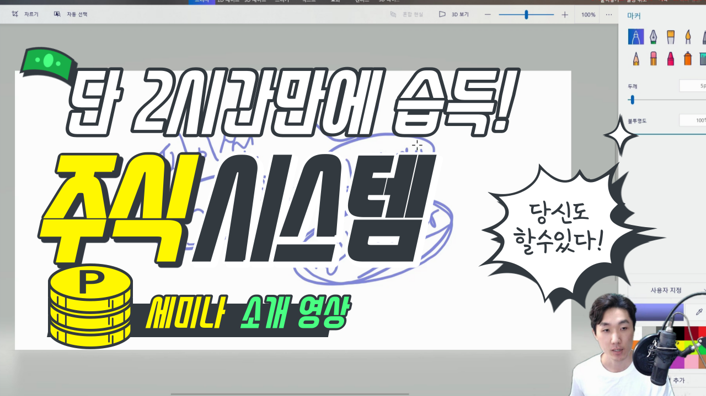

# book

### 프로그램 동산 후원하기
>삶을 개선시켜 주는 유익하고 높은 수준의  
>교육들을 무료로 제공하고 있습니다.  
>응원의 메세지를 부탁드립니다. 감사합니다.  
>####신한은행 110-285-059020 장용준

 
 

### 교재 출판 1쇄,2쇄, 3쇄, 4쇄본 폴더로 나눔
>인쇄 버전에 맞는 예제코드를 사용해 주세요.

 
 

### 8장 수정사항 (교재출판 1쇄, 2쇄 버전용)
>2020년 5월6일을 시점으로 슬랙에서 토큰 정책을 변경했습니다. 

기존 방식은 다이렉트로 토큰을 생성하는 거였지만 이제는 불가능합니다. 이전에 생성한 사용자에게는 영향이 없지만, 5월6일 이후로 슬랙 토큰을 생성하려는 분들은 기존 방식으로 불가능 합니다.
  그래서 초판 교재로 공부중이신 분들은 **교재 281페이지 ~ 285페이지**까지의 내용을 아래 링크에 업데이트된 내용으로 학습하면 됩니다.

슬랙 토큰 받는 새로운 방법 ▶ [https://cafe.naver.com/programgarden/102][https://cafe.naver.com/programgarden/102]

3쇄 버전을 이용중이면 아래 링크로 학습하면 됩니다.

슬랙 토큰 받는 새로운 방법 ▶ https://cafe.naver.com/programgarden/1664

 
 

### 교재 정보 

>무료 강의 영상에 없는 내용이 서적에 많이 포함되어 있습니다.  
대표적으로 메세지 받는 방법과 HTS의 조건검색식을 파이썬과 연동하는 방법  
그리고 데이터 관리하는 커스텀 로그 구축입니다.  
그 외에도 폭 넓은 내용들 책에서 볼 수 있고 eBook으로도 제공하고 있습니다.

&nbsp;&nbsp;

&nbsp;&nbsp;

  

&nbsp;&nbsp;

 

>교재와 유튜브 강의는 분량이 많습니다.그래서 방대한 분량을 2시간으로 압축해서 설명하는 세미나를 2020년 5월 31일에 진행했습니다. 참여하지 못한 분들을 위해서 영상으로 제작했습니다. 
학생들도 들을 수 있도록 저렴한 가격에 업로드 했으니깐 많은 도움되시길 바라겠습니다. 
감사합니다.

  

### 유튜브에서 더 많이 학습하기

>유튜브에서 주식과 더불어 해외선물, 코인, 자율주행 등  
다양한 시스템 구축을 배울 수 있습니다.
https://www.youtube.com/channel/UCq7fsrxP6oi6vnYgPkw92jg

  

### 네이버 카페 커뮤니티

>수강생들의 금융 프로그램 공부를 위한 커뮤니티 카페입니다. 
교재 내용에 대한 질의 응답과 추가 학습은 카페에서 가능합니다. 
그리고 운영진들의 금융과 프로그램에 관한 글들을 볼 수 있습니다. 
https://cafe.naver.com/programgarden

  

### 교재 및 위 오픈소스 영상으로 배우기

https://www.youtube.com/playlist?list=PLDtzZPtOGenaSknTbsb6x6L39V0VPz_rS
   

[https://cafe.naver.com/programgarden/102]: https://cafe.naver.com/programgarden/102